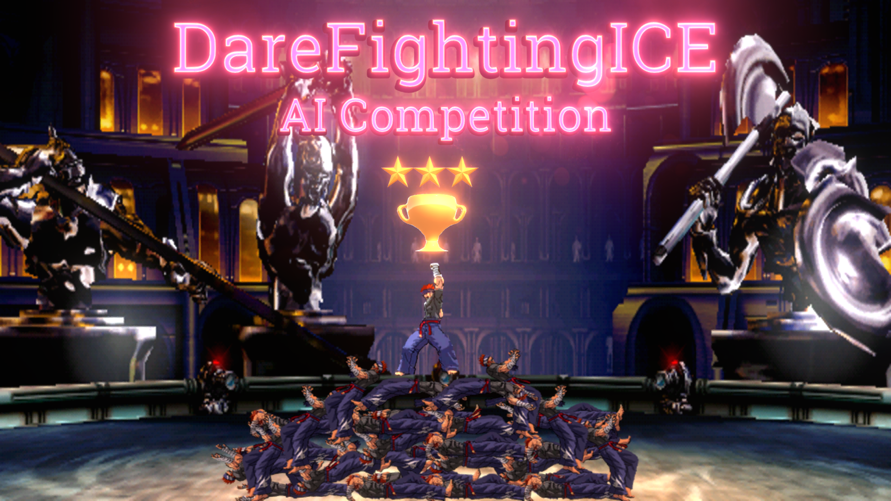

# <div align="center"> 2024 DareFightingICE AI Competition</div>
----
<div align = "center"> Welcome to the 2024 DareFightingICE AI Competition. Here you will be provided all the necessary information needed to participate in the competition. Please remember to read carefully and thoroughly before contacting us for any questions you might have. </div>
<br>
[](https://www.youtube.com/watch?v=89PfdLxtG4k)

### What is the DareFightingICE AI Competition:
----
In this competition, you are tasked with making an AI that plays DareFightingICE using only in-game sound data as the input. You will be provided with a gRPC interface that allows access to sound data and a sample AI.

### What To Submit:
---
For submission, please create a zip file containing:

- Your AI's executable file
- Source code (for training AI and evaluating AI, .py for a Python AI) and/or
- File-I/O folder with the same name as your AI
- A README file that describes the environment, file structure, and instructions to run your AI

Please also attach a PowerPoint (or OpenOffice) file describing the following information:

- AI Name, Developer's Name(s) and Affiliation(s)
- AI's Outline

### Sample AIs:
---

The source code and model of our deep reinforcement learning blind AI implemented using Python is available [here](https://github.com/TeamFightingICE/BlindAI).

See also the sample AI:
- The sample AI implemented using Python is available [here](https://github.com/TeamFightingICE/PythonAISamples).

### Rules:
---
One game has three rounds. The maximum fighting time of a round is 60s. After one round, the character's positions and HPs will be reset, and a new round is started. All games in the competition are conducted with the options "--limithp 400 400" (limit HP of both players to be 400) and "--blind-player 2" (limit access only to sound data for both players) of DareFightingICE.

Even if the game will boot with `--blind-player` option, it is still recommended to notify the game that your AI will process only audio data by modifying `isBlind` method to be as follows:
- For Python,
``` python
def is_blind(self):
   return True
```

The FrameData sent to AIs will have a delay of 15 frames, but AudioData and ScreenData have no delay. Please keep in mind that although [FrameData](https://www.ice.ci.ritsumei.ac.jp/~ftgaic/FTG-JavaAI-doc/struct/FrameData.html) and [ScreenData](https://www.ice.ci.ritsumei.ac.jp/~ftgaic/FTG-JavaAI-doc/struct/ScreenData.html) are accessible during AI training phase, in the competition, only [AudioData](https://www.ice.ci.ritsumei.ac.jp/~ftgaic/FTG-JavaAI-doc/struct/AudioData.html) is provided to all the participating AIs.

Your AI will be made publicly available and by submitting you will have agreed to this.

### Evaluation:
---
Two leagues (Standard and Speedrunning) in this competition are described as follows:
The Standard League considers the winner of a round as the one with the HP above zero at the time its opponent's HP has reached zero. Both AIs will be given the initial HP of 400. The league for a given character type is conducted in a round-robin fashion with two games for any pair of entry AIs switching P1 and P2. The AI with highest number of winning rounds becomes the league winner; If necessary, remaining HPs are used for breaking ties. In this league, our weakened sample MctsAi with limited to 23 iterations per frame, played in the non-blind mode or with FrameData, and our [sample deep-learning blind AI](https://github.com/TeamFightingICE/BlindAI), played in the blind mode, will also be participating as baseline AIs.

In the Speedrunning League, the league winner of a given character type is the AI with the shortest average time to beat both of our aforementioned sample AIs. For each entry AI, 5 games are conducted with the entry AI being P1 and a sample AI being P2, and another set of 5 games with the entry AI being P2 and a sample AI being P1. Both AIs will be given the initial HP of 400. If a sample AI of interest cannot be beaten in 60s, the beating time of its opponent entry AI is penalized to 70s. <br>

In this competition, only "Zen" character, with the same [motion data](https://www.ice.ci.ritsumei.ac.jp/~ftgaic/Downloadfiles/Motion/ZEN/Motion.csv) as the motion data included in DareFightingICE will be used.

The ranking rules are as follows:
In each of the two leagues (in this order: Zen Standard, Zen Speedrunning), the AIs are ranked according to the number of winning rounds. If ties exit, their total remaining HPs will be used. Once the AIs are ranked in each league, league points are awarded to them according to their positions using **[the 2018 Formula-1 scoring system ](https://en.wikipedia.org/wiki/2018_Formula_One_World_Championship#Scoring_system)**. The competition winner is finally decided by the sum of league points across all two leagues.

In the 2024 Competition, we are transitioning from the Java platform to Unity. We also plan to integrate our previously mentioned weakened sample, MctsAi23i, into the main game. Consequently, its source code cannot be made public.

### Evaluation Environments: 
---
1. Software:
   - OS: Windows 10
   - Python: 3.10
   - CUDA: 11.8
   - PyTorch: 2.0.0
   - TorchAudio: 2.0.0
   - TorchVision: 0.15.0
2. Hardware:
   - CPU: Intel(R) Xeon(R) W-2135 CPU @ 3.70GHz
   - RAM: 16 GB
   - GPU: NVIDIA Quadro P1000 4GB VRAM

### Installation Guide:
---
To install DareFightingICE please follow the instructions on this (TBA).

### <b>Prizes: (updated on February 12, 2024) </b>
This following information is subject to approval!<br>
A money prize of $500 from IEEE CIS will be awarded to the qualified winner of the competition. For more details of the prize distribution policy, please see this <a href="https://cis.ieee.org/images/files/Documents/competitions/prize-dist-policy.pdf" target="_blank">page</a>.

### Organizers:


1. Van Thai Nguyen, Graduate School of Information Science and Engineering, Ritsumeikan University
2. Ibrahim Khan, Graduate School of Information Science and Engineering, Ritsumeikan University
3. Chollakorn Nimpattanavong, Graduate School of Information Science and Engineering, Ritsumeikan University
4. Kantinan Plupattanakit, Graduate School of Information Science and Engineering, Ritsumeikan University
5. Boyu Chuang, Graduate School of Information Science and Engineering, Ritsumeikan University
6. Ruck Thawonmas, College of Information Science and Engineering, Ritsumeikan University

### Submission:
---

Please submit your entry via this [page](https://forms.gle/fCRiRUPvVxYjaT5b9). Below are the deadlines.

Midterm deadline (We recommend you do midterm submission, but if you miss it, you can still submit your AI to us by the final deadline.)
- May 24, 2024 (AoE)

Final deadline (**closed**)
- July 29, 2024 (AoE)(no extension!!)

#### Note that all the submissions will be made publicly available after the competition.
