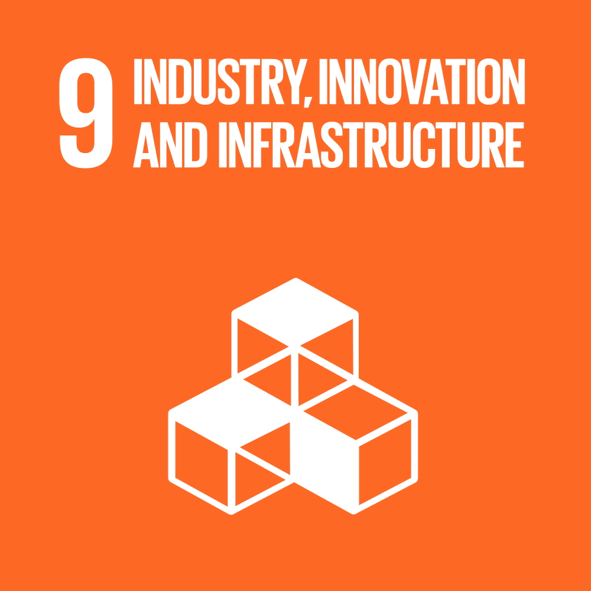
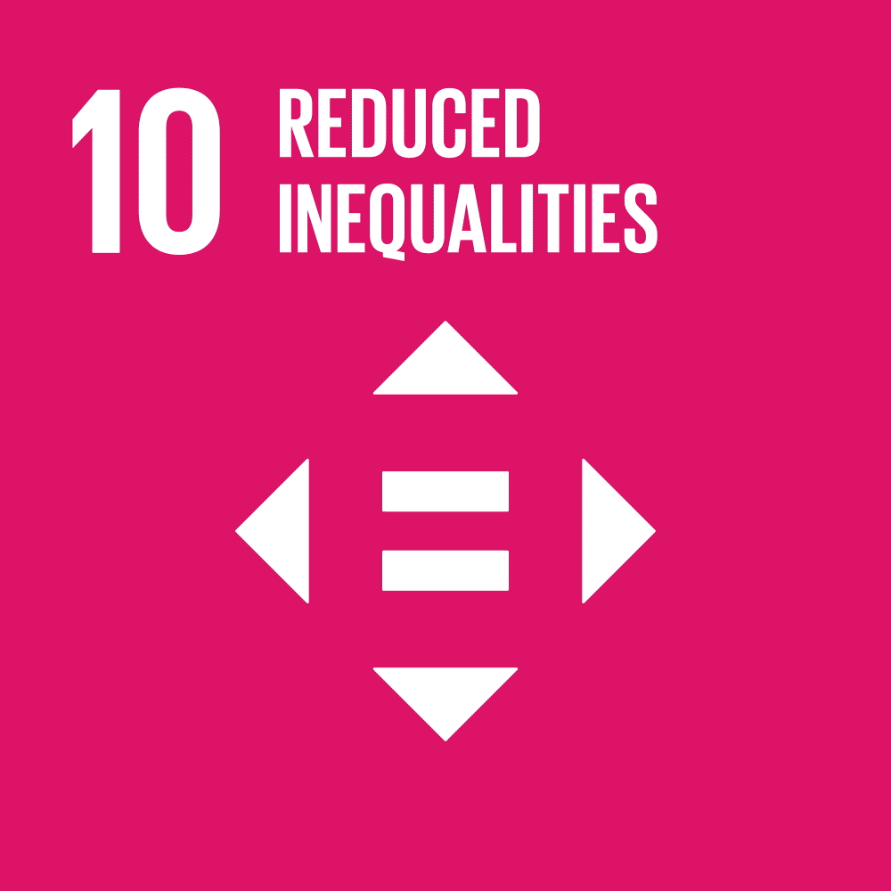

# 
<b>DareFightingICE </b>

# 
*2023 Competition @ CoG 2023*

## 
<b>A fighting game competition for promoting the sound design of fighting games, targeting visually impaired players</b>

**We hope research findings from this competition could contribute to Sustainable Development Goals:**

 
&emsp;&emsp;&emsp;&emsp;&emsp;&emsp;&emsp;&emsp;

Welcome to the <b>DareFightingICE Competition</b>. This competition is our way of including one of the most ignored group of players when it comes to video games. You are invited to develop an AI and/or design a sound design for Java-based DareFightingICE, FightingICE with an enhanced sound design where we define a sound design as a set of sound
effects combined with the source code that implements their timing-control algorithm. FightingICE itself had been successfully used in a fighting game AI competition launched in 2013 and from 2014 to 2021 as an official competition at IEEE CIG/CoG. From <a href="https://ieee-cog.org/2022/" target="_blank">CoG 2022</a>, there are two tracks. The first track is an AI competition, and the second track is a sound-design competition. You are invited to submit an AI capable of operating with only sound input information or/and a sound design for visually impaired players. 

To know more about FightingICE, visit the website of <a href="https://www.ice.ci.ritsumei.ac.jp/~ftgaic/index.htm" target="_blank">FightingICE.</a>
 

### <b>AI Track:</b>
See <a href="https://tinyurl.com/DareFightingICE/AI" target="_blank">this page</a> for the details of this track. 

### <b>Sound Design Track:</b>
See <a href="https://tinyurl.com/DareFightingICE/Sound" target="_blank">this page</a> for the details of this track. 

### <b>Prizes:</b>
TBA (updated on Mar 18, 2023)
<!---A money prize of $500 from IEEE CIS will be equally split and awarded to the qualified winner of each track (i.e., $250 each). However, if there is only one qualified winner, that winner will be awarded with $500. For more details of the prize distribution policy, please see this <a href="https://cis.ieee.org/images/files/Documents/competitions/prize-dist-policy.pdf" target="_blank">page</a>.---> 

### <b>Results:</b>
The 2022 competition results are avialable on this <a href="https://www.ice.ci.ritsumei.ac.jp/~ftgaic/index-R.html" target="_blank">page</a>.

### <b>Papers:</b>
Read also: 
<a href="http://arxiv.org/abs/2303.15734" target="_blank">the document</a> about adaptive BGM (@our paper's reviewers: this is a longer non-peer-reviewed version of the paper you are reviewing, please do not click the link because the author information is shown therein)</a>  
<a href="http://arxiv.org/abs/2303.10001" target="_blank">the paper</a> about the introduced gRPC framework at <a href="https://icbir.tni.ac.th/" target="_blank">ICBIR 2023</a>  
<a href="https://ieee-cog.org/2022/assets/papers/paper_133.pdf" target="_blank">the paper</a> about the competition at <a href="https://ieee-cog.org/2022/" target="_blank">IEEE CoG 2022</a>  
<a href="https://ieee-cog.org/2022/assets/papers/paper_223.pdf" target="_blank">the paper</a> about our blind sample AI at <a href="https://ieee-cog.org/2022/" target="_blank">IEEE CoG 2022</a> 
 
Click [here](https://www.ice.ci.ritsumei.ac.jp/~ftgaic/index-4.html) for relevant links and a full list of publications. 

### <b>Facebook:</b>
Here is our <a href="https://www.facebook.com/ftg.aic" target="_blank">FB page</a>. Please do not forget to subscribe! 

### <b>Team Members:</b>
Click [here](https://www.ice.ci.ritsumei.ac.jp/~ftgaic/index-5.html) for a list of team members since 2013.

### <b>Contact Us:</b>
ftg dot aic at gmail dot com 

---
